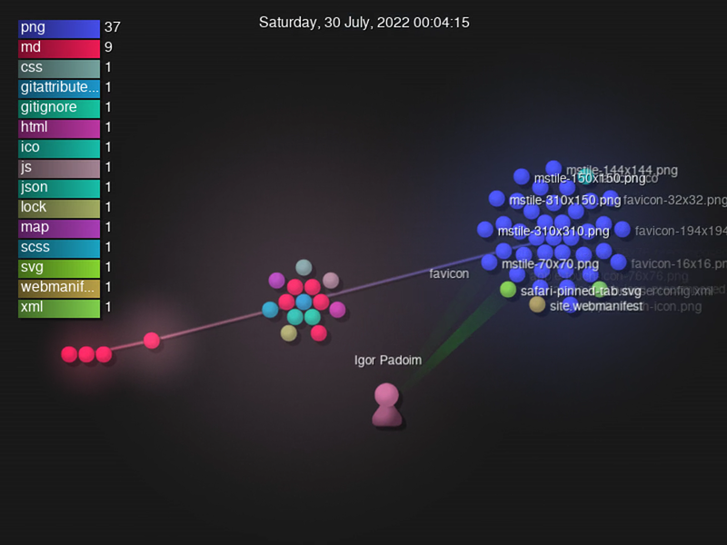

# Arcane Blight Tracker

A simple, embedable, tracker for the exploration of Ythryn in "Icewind Dale: Rime of the Frostmaiden".

## Project Visualization

## Contributing

1. Fork it!
2. Create your feature branch: `git checkout -b my-new-feature`
3. Commit your changes: `git commit -am 'Add some feature'`
4. Push to the branch: `git push origin my-new-feature`
5. Submit a pull request :tada:

Please, also read our [Contributing Guidelines](CONTRIBUTING.md).

### Code of Conduct

Please note that this project is released with a [Contributor Code of Conduct](CODE-OF-CONDUCT.md).

By participating in this project you agree to abide by its terms.

## History & Versioning

See the [Change Log](CHANGELOG.md) for further history.

This project uses [SemVer](http://semver.org/) for versioning. For the versions
available, see the [tags on this repository](https://github.com/Nereare/arcane-blight-tracker/tags).

## License

This project is available under the [Do What The F*ck You Want To Public License](http://www.wtfpl.net/).
